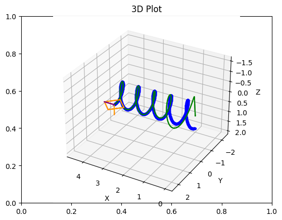
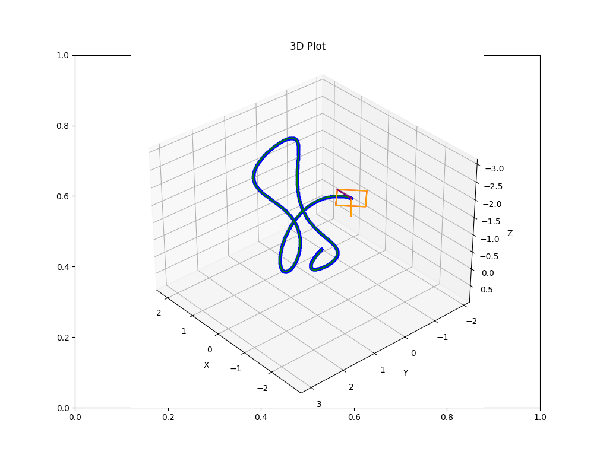
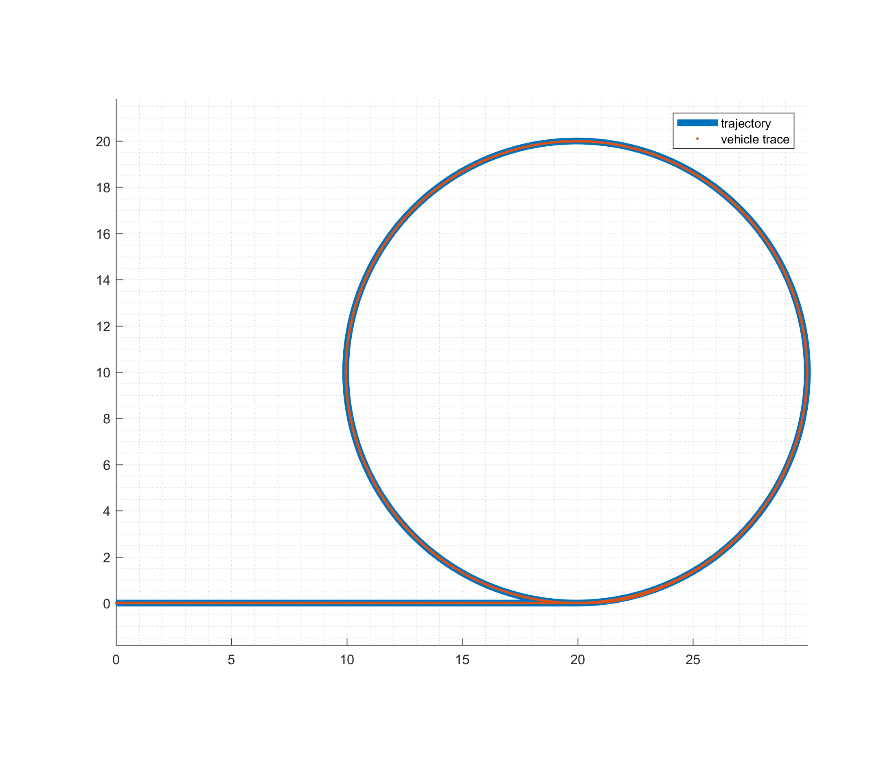

Yiming is a control engineer in the autonomous driving industry and a graduate of the University of Michigan with a master's degree in Aerospace Engineering. After several years of exploring classical control techniques, he has begun delving into exciting research topics at the intersection of control and machine learning.  

## Personal projects
A Python-based drone simulation in 3D space has been developed to apply control algorithms in aerial robotics.  

A MATLAB/Simulink-based vehicle simulator has been developed to apply control algorithms for lane-following.    
